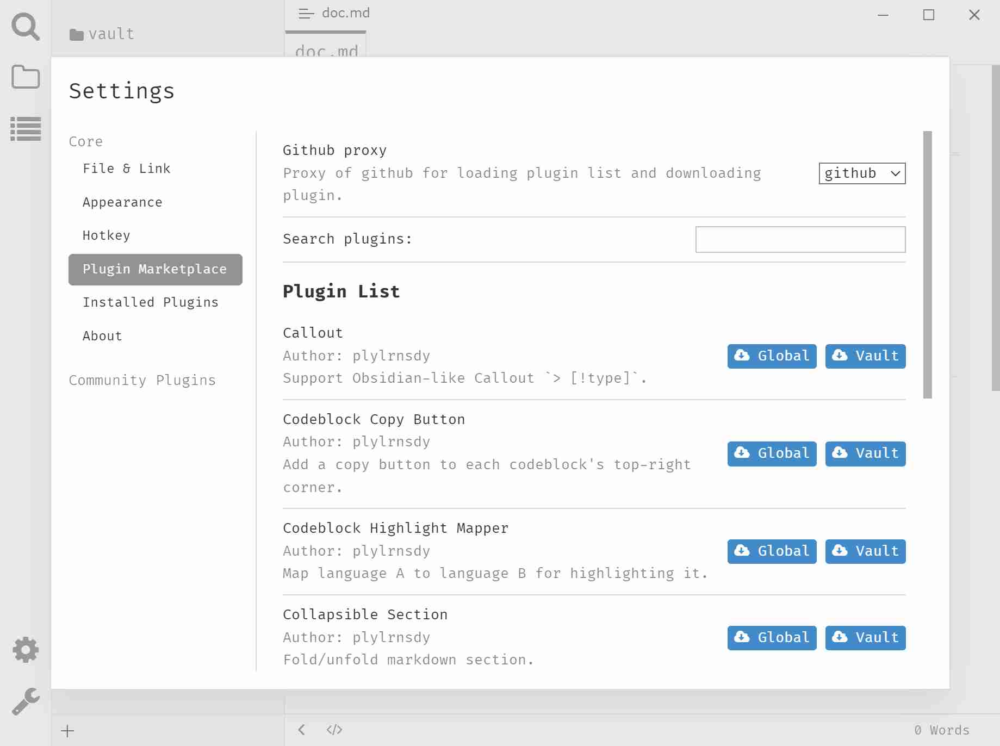

# Typora Community Plugin

[English](https://github.com/typora-community-plugin/typora-community-plugin#README.md) | 简体中文

一个适用于 [Typora](https://typora.io/) 的社区插件系统。受到 [Obsidian 插件系统](https://docs.obsidian.md/Home) 启发。

**警告**: 第三方插件可能有数据和隐私风险。

安全起见，请安装可以审查源码的开源插件。

## 模块

- `installer`: 注入 `loader` 到 Typora。
- `loader`: 决定加载哪个版本的 `core` (生产环境或开发环境)。
- `core`: 提供扩展 Typora 的 API 并管理插件。
- `types`: Typora 全局变量的类型。
- `esbuild-plugin`: 使用 esbuild 构建 `core` 和插件。

## 兼容性

| 已测试  |                |                |             |
| :----: | -------------- | -------------- | ----------- |
| Typora | v1.5.x, v1.6.x | v1.5.x, v1.6.x | v1.4.8      |
| 系统    | Windows 10     | Ubuntu 22      | macOS 10.13 |

## 特性

- 插件管理
  - [x] 安装/卸载/更新 插件
  - [x] 启用/禁用 插件
- 新的 UI 组件
  - [x] Ribbon
  - [x] (模拟的) 多文件标签页
- [x] 自定义命令的快捷键
- 扩展 Typora 的 APIs
  - [x] Markdown 前处理器
  - [x] Markdown 后处理器
  - [x] Markdown 自动完成
- [x] I18n: 跟随系统或手动配置，现在支持英语和中文
- [x] 兼容 macOS
- 文档
  - [ ] 用户文档
  - [ ] 开发文档

## 预览

| Ribbon & 多文件标签页                   | 命令面板                                   |
| :-----------------------------------: | :---------------------------------------: |
|            |       |
| 配置对话框                              | 插件市场                                   |
|  |  |

## 安装

### 脚本安装

1. 从 [Release](https://github.com/typora-community-plugin/typora-community-plugin/releases) 下载 `typora-community-plugin.zip`。
2. 解压文件。
3. 以管理员身份运行 `install.ps1` (只适用于 Windows)。   如果你想为自定义安装目录的 Typora 安装它，请以管理员身份运行 `install.ps1 -root <TyporaHome>`。

### 手动安装

Windows 用户

1. 从 [Release](https://github.com/typora-community-plugin/typora-community-plugin/releases) 下载 `typora-community-plugin.zip`。
2. 解压文件。
3. 复制文件到 `%UserProfile%/.typora/community-plugins`。
4. 创建文件夹的符号链接。以管理员身份运行 `cmd` ，然后运行命令 `mklink /d %UserProfile%\\AppData\\Roaming\\Typora\\plugins %UserProfile%\\.typora\\community-plugins`。
5. 修改文件 `{Typora 安装目录}/resources/window.html`。使用 UTF-8 编码打开该文件，替换文件末尾的文本 `</body></html>` 为 `</body></html>`。

Linux 用户

1. 从 [Release](https://github.com/typora-community-plugin/typora-community-plugin/releases) 下载 `typora-community-plugin.zip`。
2. 解压文件。
3. 复制文件到 `~/.config/Typora/plugins`。
4. 修改文件 `/usr/share/typora/resources/window.html`。使用 UTF-8 编码打开该文件，替换文件末尾的文本 `</body></html>` 为 `</body></html>`。

macOS 用户

1. 从 [Release](https://github.com/typora-community-plugin/typora-community-plugin/releases) 下载 `typora-community-plugin.zip`。
2. 解压文件。
3. 复制文件到 `/Users/{UserName}/Library/Application%20Support/abnerworks.Typora/plugins`
4. 右键 `Typora.app`，点击“显示包内容”，进入应用内部文件夹，修改文件 `Typora.app/Contents/Resources/TypeMark/index.html`。使用 UTF-8 编码打开该文件，替换文件末尾的文本 `</body>` 为 `</body>`，其中 `{UserName}` 需要替换为你的 macOS 账号名。

## 使用

### 快捷键

| 快捷键                       | 功能         |
| --------------------------- | ----------- |
| <kbd>F1</kbd>               | 打开命令面板  |
| <kbd>Ctrl</kbd>+<kbd>.</kbd>| 打开设置对话框 |

## 贡献

欢迎 pull requests。

## 支持

如果你用任何问题或建议可以在 [这里](https://github.com/typora-community-plugin/typora-community-plugin/issues) 创建一个 Issue。
